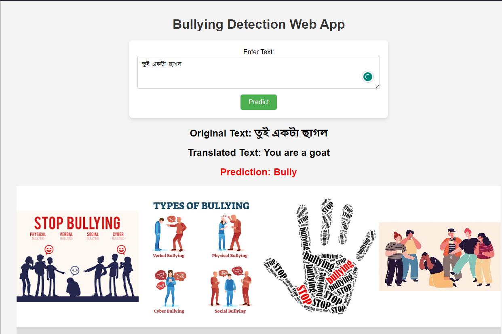
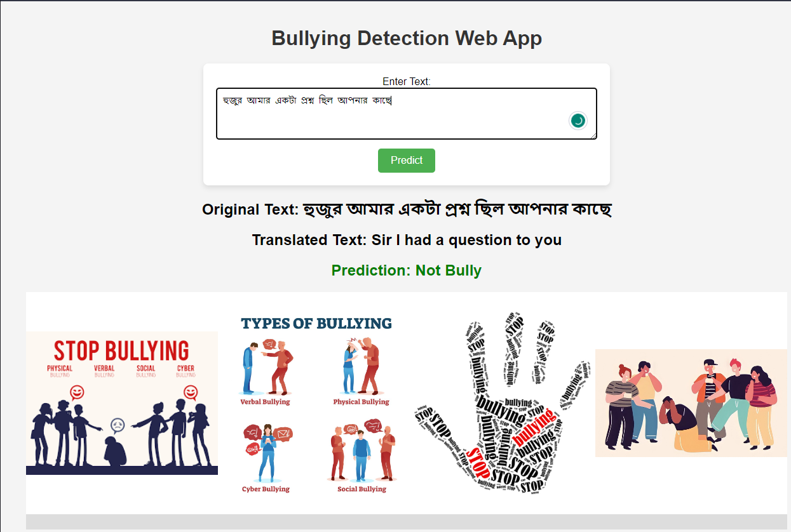

# 🚫 Bangla Cyberbullying Detection
This project focuses on detecting cyberbullying in social media platforms, specifically for the Bangla language. We created a robust, custom dataset by manually collecting comments and posts from three major social media sites: Facebook, YouTube, and X (formerly Twitter).

The primary goal of this project is to help reduce online bullying and raise public awareness around the issue. To achieve this, we trained and evaluated various machine learning models on our curated dataset. 
The best-performing models were then deployed to power a web-based application, allowing users to detect whether a given comment or post is considered cyberbullying.

Key features of the website include:

🔍 Bangla text detection: Determine if a Bangla comment or post is bullying.

🌐 Built-in translation feature to convert Bangla text to English text for classification. 

## Website demo

